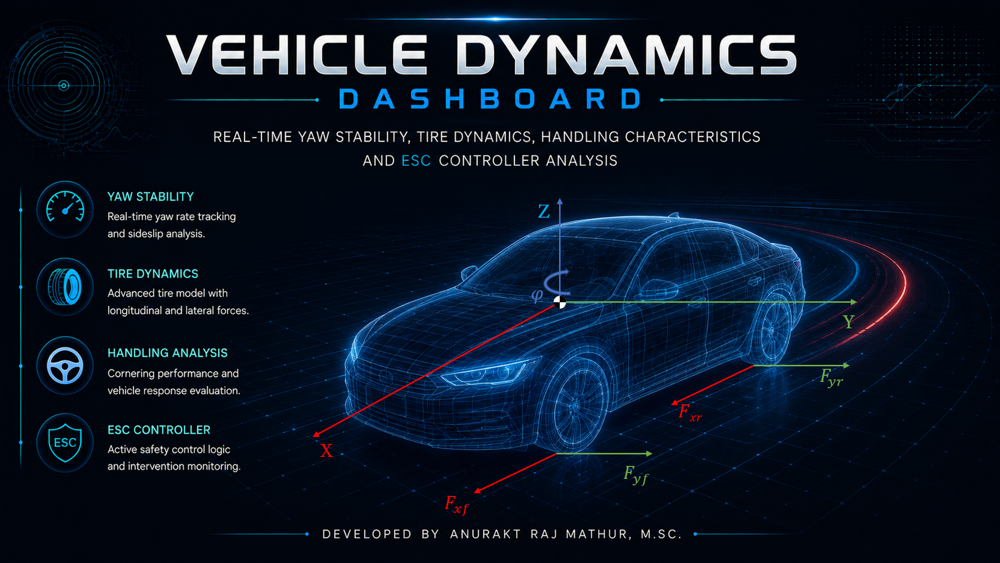
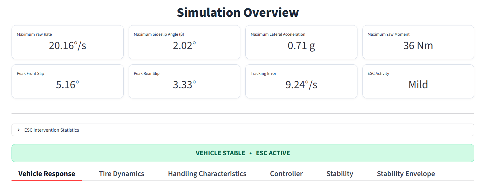

# Vehicle Dynamics Dashboard



An interactive **Vehicle Dynamics & Yaw Stability Control Dashboard** developed using **Python** and **Streamlit** for real-time visualization of lateral vehicle dynamics, tire behaviour, and ESC intervention.

The project combines a nonlinear 2-DOF vehicle model with a Pacejka tire model and a predictive Electronic Stability Control (ESC) strategy to simulate realistic vehicle handling behaviour under varying driving conditions.

---

# ✨ Features

- Real-time yaw stability analysis
- Nonlinear Pacejka tire model
- ESC / Yaw Stability Control (YSC) visualization
- Interactive simulation controls
- Stability envelope analysis
- Tire dynamics monitoring
- Vehicle handling characteristics
- Dynamic controller intervention logic
- Real-time plotting and dashboard analytics
- High-fidelity futuristic dashboard UI

---

## Main Dashboard

### Simulation Overview



---

# 📂 Project Structure

```bash
Vehicle-Dynamics-Dashboard/
│
├── dashboard.py
├── vehicle_model.py
├── README.md
│
├── assets/
│   ├── welcome_page.png
│   ├── vehicle_dynamics_logo.png
│   ├── up-arrow.png
│   └── ...
│
└── requirements.txt
```

---

# ⚙️ Vehicle Model

The simulation uses:

- Nonlinear 2-DOF bicycle model
- Pacejka Magic Formula tire model
- Reference yaw-rate tracking
- Predictive ESC logic
- Gain-scheduled controller
- Yaw moment saturation and rate limiting
- Real-time stability classification

---

# 📈 Simulated Parameters

The dashboard visualizes:

- Yaw Rate
- Reference Yaw Rate
- Sideslip Angle
- Tire Slip Angles
- Tire Forces
- Lateral Acceleration
- Yaw Moment
- Vehicle Trajectory
- ESC Activity
- Stability Classification

---

# Interactive Controls

Users can configure:

- Vehicle speed
- Steering angle
- Steering input type
- Surface friction coefficient
- ESC ON/OFF
- Stability sweep studies
- Controller gains

---

# Requirements

Install dependencies using:

```bash
pip install -r requirements.txt
```

Required libraries include:

```bash
streamlit
numpy
matplotlib
pandas
scipy
```

---

# Running the Dashboard

Ensure that:

- `dashboard.py`
- `vehicle_model.py`

are located in the same directory.

Run the dashboard using:

```bash
streamlit run dashboard.py
```

---

# ESC Controller Logic

The implemented ESC controller includes:

- Yaw-rate tracking
- Sideslip suppression
- Predictive instability detection
- Nonlinear gain amplification
- Speed-dependent gain scheduling
- Intervention escalation logic
- Yaw moment saturation

---

# Coordinate System

The dashboard follows the ISO vehicle dynamics sign convention:

- **X-axis** → Forward direction
- **Y-axis** → Vehicle left
- **Z-axis** → Upward direction

---

# UI Design

The interface was designed with:

- Futuristic aerospace-inspired aesthetics
- Dark-mode visualization
- Minimal neon-accent styling
- Fullscreen animated welcome page
- Smooth dashboard transitions

---

# Developed By

**Anurakt Raj Mathur, M.Sc.**

Vehicle Dynamics • Autonomous Systems • Control Engineering

---

# License

This project is intended for educational, research, and demonstration purposes.
